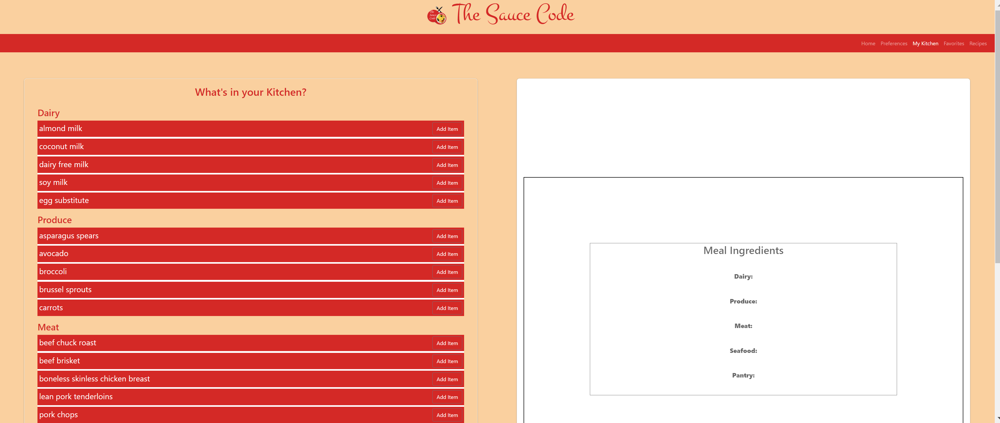
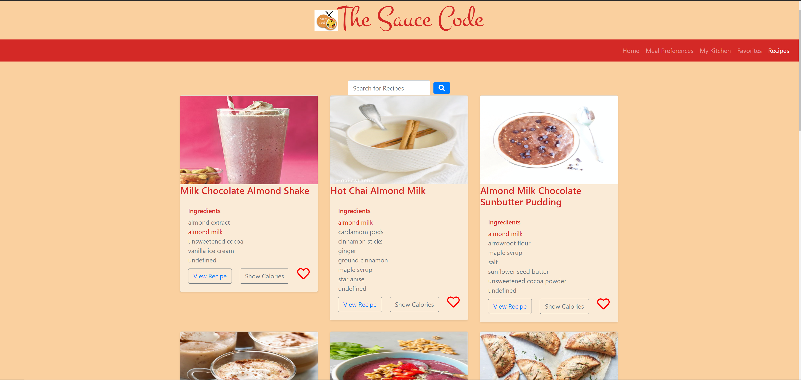

# Project Title: The Sauce Code 
Please see Team Digital Designs' project portifio here: 
[https://docs.google.com/presentation/d/16QFv8JjmIW0_XDhOlu1_q5TesVMT2_3SW0C9ipjwJ4U/edit?usp=sharing] 

Sauce Code is a web application that allows users to search recipes and quickly identify what ingredients they have avilable. Users can also save their favorite recipes to revisit later. 

Deployed Project [https://ashaheed3.github.io/project-1/]
  
## Installation
  
1. Clone repo
2. Open project folder in browser

## Usage

Select the ingredients you already have from MyKitchen

Go to Recipes to search for recipes. Ingredients from My Kitchen are displayed in red. 

Recipes can be saved to my Favorites.

User can also discover new recipes according to a dietary prefernce

## Contributing

[@DannieDigital](https://github.com/DannieDigital) - Home, My Kitchen

[@domwarit](https://github.com/domwarit) - Meal Preferences

[@clemsontigress](https://github.com/clemsontigress) - Favorites

[@ashaheed3](https://github.com/ashaheed3) - Recipes

## Questions
Have a question? Shoot me an email
Email: [ayanna.shaheed@gmail.com](mailto:ayanna.shaheed@gmail.com)
    
